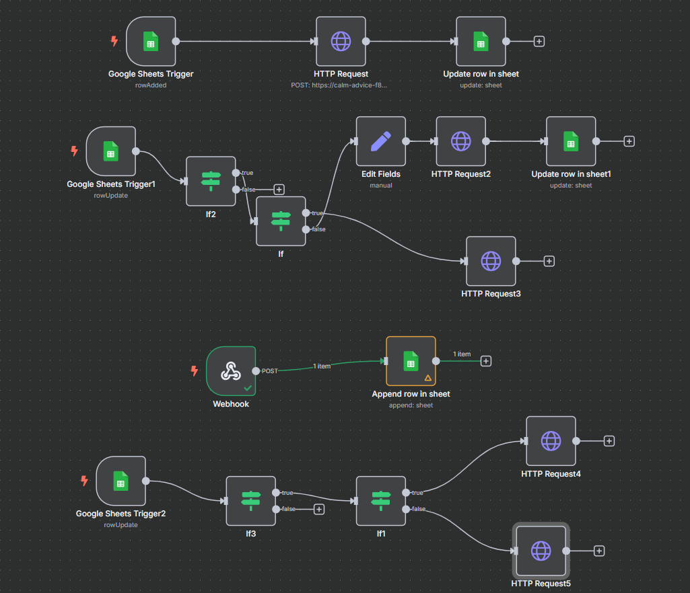

# Concert Ticketing Platform

## Overview

This project is a web application designed for a concert ticketing platform, allowing visitors to view available concerts and their respective tickets. The solution covers the entire workflow from backend data management using an open-source headless CMS, through to the frontend display of ticket information.

## Specifications

### 1. Headless CMS Selection
- **Chosen CMS**: **Strapi (Node.js)**
  - **Reason for Selection**:
    - API-first architecture allows for easy integration with frontend applications.
    - Built-in admin panel for managing content.
    - Flexible data modeling capabilities to define custom data structures for events and tickets.
    - Uses RESTful API

### 2. Data Models
- **Event Model**:
  - `id*` (UUID)
  - `eventName` (String)
  - `artistOrBandName*` (String)
  - `eventDate*` (Date)
  - `startTime*` (Time)
  - `location` (String)
  - `description` (Text)
  - `coverPhoto` (String - link)

- **Ticket Model**:
  - `id` (UUID)
  - `eventId` (Relation to Event)
  - `buyerName` (String)
  - `quantity` (Integer)

* denoted required

There are some assumptions with this data model:
- There is no fixed end time for events
- Only the start date of concert is recorded. It might continue until midnight, but the next date is not recorded
- Since there is no price for tickets, all tickets are equal and there are no tickets type (e.g. standard, VIP)
- There is no upper limit for quantity of tickets purchased as of now
### 3. Google Spreadsheet Integration
- **Purpose**: To allow users to manage event and ticket data via CRUD operations without direct access to the CMS admin panel.
- **Implementation**:
  - **Google Sheets** used as the data management interface.
  - Real-time updates to the CMS are achieved via n8n.io which triggers API calls to Strapi whenever changes are made in the Google Sheet and vice versa.
  - This is a snapshot of the workflows implemented in n8n.io for automation:
  
    - First flow look for new rows in events sheet every minute. If any row is added, it sends data to strapi, which sends the createdAt, updatedAt and documentId back which is also needed for PUT request later
    - If there is any change in row, it checks if the event Id is null for that row. If yes, then it makes a DELETE request using the document Id. If not, then all the other changes are updated.
    - To implement creating tickets in sheets is a bit indirect. First a call is made to strapi from frontend to create an entry for a ticket. Then the response (with createdAt and documentId) is sent back to a webhook call in order to trigger the event in the workflow. This in turn updates the google sheets. This process is instant
    - Lastly, similar to changes in event row, the flow deletes or updates tickets based on changes in the tickets sheet
### 4. Frontend Development
- **Technology**: Next.js
- **Functionality**:
  - Fetches data from Strapi via RESTful APIs.
  - Displays a list of events.
  - Handles booking events and making webhook calls to update google sheet.
  - Responsive design to ensure usability across devices.

## Future Prospects
- Implement a checkout system for ticket purchases.
- Add user authentication for a personalized experience.
- Make tickets downloadable as a pdf.
- Generate a QR code for tickets instead of ID.
- Expand the CMS model to include additional features such as user reviews, seat selection, and event categories.
